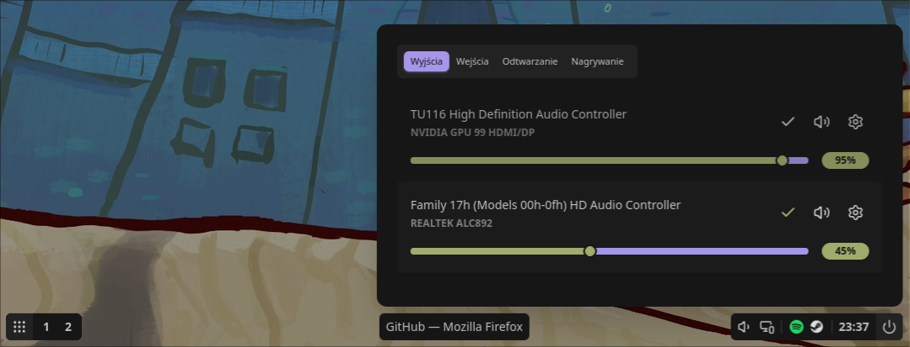
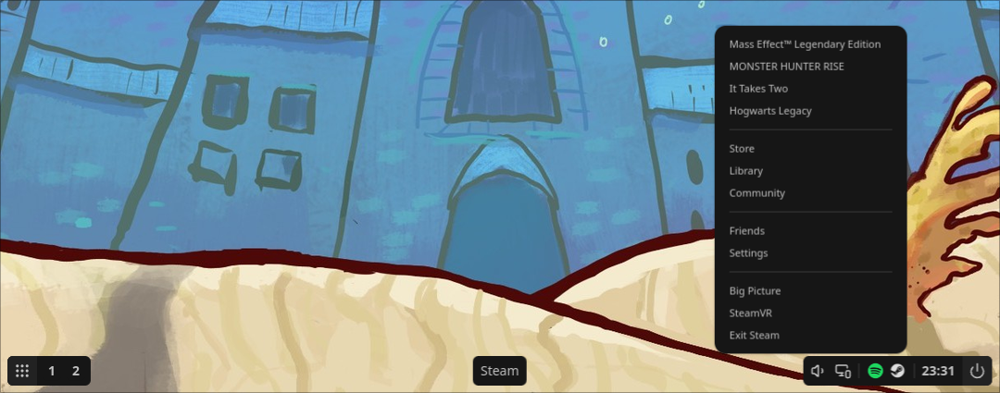

# MeqeqBar

A status bar for Hyprland written in Tauri and Angular. 

## Features

- Workspaces
- Sound panel
- Power menu
- Tray icons with menus
- Time/Calendar

## Information

MeqeqBar uses Wayland's layer shell protocol, allowing it to occupy the reserved space at the bottom of the screen. It uses Rust bindings for Hyprland to manage and switch between workspaces, and integrates with PipeWire to control audio devices and nodes. Additionally, it communicates over D-Bus to obtain system tray information. It also uses other Linux programs to launch apps or power off the computer.

## Dependencies

- Hyprland
- GTK
- Pipewire
